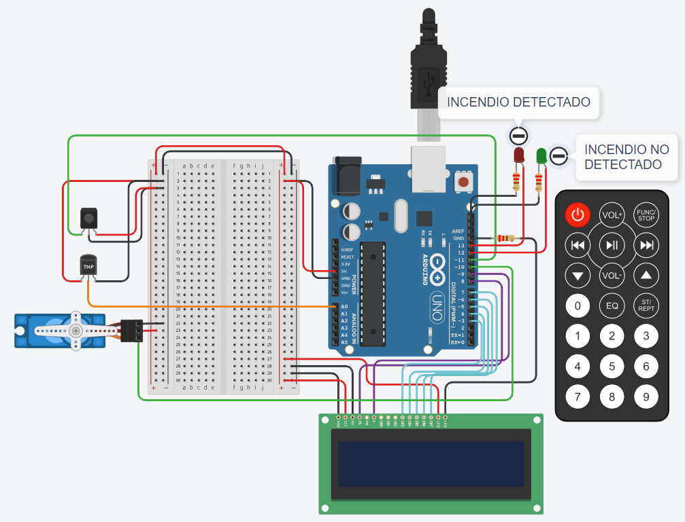
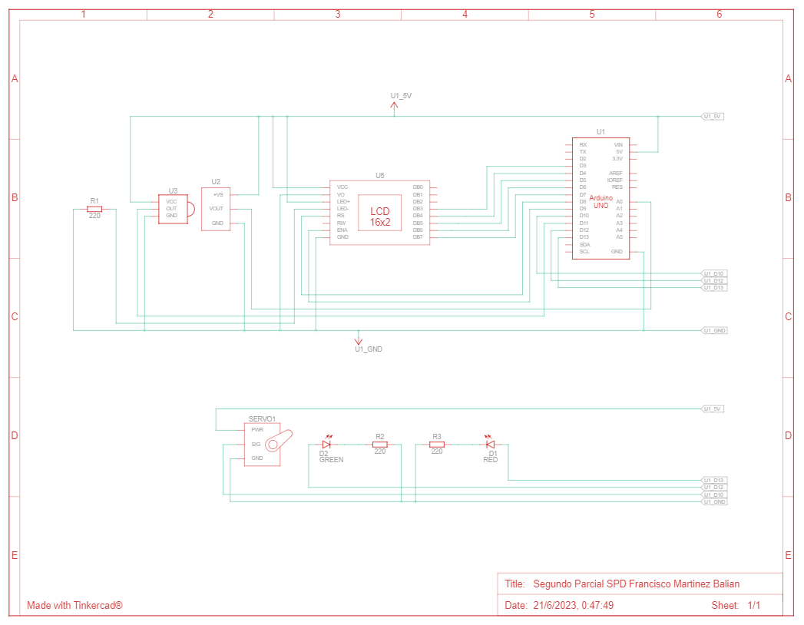

# Documentación SPD Segundo Parcial

# Proyecto: Sistema de incendios

## Descripción
Este proyecto se creó con la intención de lograr un sistema de incendios el cual es manejado mediante un control remoto por IR. Tiene dos leds que informan cuando se detecta un incendio o no, utiliza un sensor de temperatura y un servo para simular una lluvia cuando se activa el sistema. La temperatura es mostrada por un display LCD 16x2.

# Diagrama Esquemático

En la parte central del diagrama se puede observar el display LCD, el cual esta conectado a la placa de Arduino (se encuentra en la parte derecha superior) y además a una protoboar la cual no es visible en el diagrama. Sin embargo, la conexiones a GND y a 5V son representadas por la linea superior verde (cuadrante A sería 5V) y por la linea inferior verde (cuadrante C sería GND).
En la parte izquierda se puede observar el receptor IR del control remoto y el sensor de temperatura. Y en la parte inferior del diagrama, se puede ver el servo y los dos leds conectados al Arduino.

## Función principal: detectarIncendio(float temperaturaMax, float minServo, float maxServo)
Esta funcion se encarga de detectar un incendio en caso de que se supere la temperatura maxima.
- temperaturaMax corresponde a la temperatura maxima soportada en determinada estacion. 
- minServo corresponde a los grados mínimos que va a inclinarse el servo. 
- maxServo corresponde a los grados máximos que va a inclinarse el servo.

~~~ C (lenguaje en el que esta escrito)

detectarIncendio(50, 00, 80);; //llamada a la funcion

void detectarIncendio(float temperaturaMax, float minServo, float maxServo)
{
  if(temperatura > temperaturaMax)
  {
    displayLCD.setCursor(0, 0);
    displayLCD.print("ALERTA");
    displayLCD.setCursor(0, 1);
    displayLCD.print("FUEGO DETECTADO");
    myServo.write(minServo);
    delay(50);
    myServo.write(maxServo);
    delay(50);
    displayLCD.clear();
    prenderLed(LED_ROJO);
    apagarLed(LED_VERDE);
  }
  else
  {
    myServo.write(maxServo);
    displayLCD.setCursor(0, 0);
    displayLCD.print(texto);
    displayLCD.setCursor(0, 1);
    displayLCD.print(temperatura);
    displayLCD.print(" grados ");
    apagarLed(LED_ROJO);
    prenderLed(LED_VERDE);
  }
}
~~~
## :robot: Link al proyecto
- [Proyecto de Tinkercad](https://www.tinkercad.com/things/bJ1peZzM5zt?sharecode=nKyDBgnBMSHgbgtATDvAolkOi3ba2YfakPWUEIFKiww)
